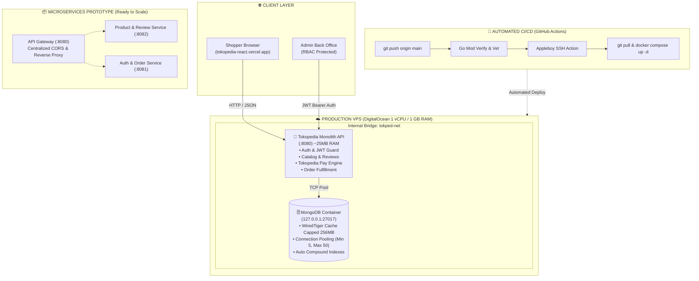

# 🚀 TOKOPEDIA BACKEND — High Performance Go Monolith & Microservices Engine

[](https://github.com/mazkev/tokped-backend/actions/workflows/deploy.yml)
[](https://go.dev/)
[](https://gin-gonic.com/)
[](https://www.mongodb.com/)
[](https://www.docker.com/)
[](http://143.198.166.143:8080/swagger/doc.json)

Backend REST API berkecepatan tinggi untuk platform **Tokopedia Clone (TOKOPEDEI)**, dibangun dengan arsitektur **Clean Architecture** menggunakan **Golang**, **Gin Framework**, dan **MongoDB**. 

Dilengkapi dengan sistem **In-House Tokopedia Pay Payment Simulator**, **Admin RBAC Security**, **Connection Pooling**, serta **Automated CI/CD Pipeline via GitHub Actions** ke Cloud VPS.

🌐 **Live Production Base URL**: `http://143.198.166.143:8080/api`  
📖 **Interactive Swagger Docs**: `http://143.198.166.143:8080/swagger/doc.json`  
🖥️ **Live Frontend Application**: [https://tokopedia-react.vercel.app](https://tokopedia-react.vercel.app)

---

## 🏛️ Arsitektur Sistem (System Architecture)



---

## 🌟 Fitur Unggulan (Key Features)

### 1. 💳 Tokopedia Pay Engine (In-House Payment Gateway Simulator)
* **BCA Virtual Account**: Format unik `80777` + generator acak 9-digit, verifikasi otomatis.
* **QRIS Dinamis**: Payload standar nasional (NMID `ID1020039201948`) yang scannable dengan animated laser beam di frontend.
* **Endpoint Pelunasan Instan**: `POST /api/orders/:id/pay` memvalidasi kepemilikan transaksi, mengubah status pesanan ke `"Diproses"`, dan mencatat timestamp pelunasan (`paidAt`).
* **Live Expiration Timer**: Penghitung batas waktu 24 jam dengan status tracking (`PENDING` ➔ `PAID` / `EXPIRED`).

### 2. ⚡ Kinerja Tinggi & Efisiensi Memori (Low Footprint)
* **Ultra Lightweight**: Hanya mengonsumsi **~25 MB RAM** saat runtime.
* **WiredTiger Cache Capped**: Membatasi penggunaan memori MongoDB maksimal **256 MB** (`--wiredTigerCacheSizeGB 0.25`), aman 24/7 di VPS 1 GB.
* **Connection Pooling**: Driver MongoDB v2 dikonfigurasi dengan `minPoolSize: 5`, `maxPoolSize: 50`, dan `maxConnIdleTime: 5m`.
* **Database Indexes**: Compound & unique indexes pada `users.email`, `products.category`, `products.price`, `orders.user_id`, dan `reviews.product_id`.
* **Log Rotation**: Ukuran log container dibatasi 10 MB (maks 3 file).

### 3. 🛡️ Keamanan & Otorisasi
* **JWT Authentication**: Enkripsi token berbasis HMAC-SHA256 dengan expiration handling.
* **Bcrypt Password Hashing**: Standar keamanan industri (cost factor 10).
* **Role-Based Access Control (RBAC)**: Middleware `AdminOnly()` memblokir akses rute admin dari pengguna biasa.
* **Network Isolation**: Port MongoDB `27017` dikunci secara internal ke `127.0.0.1`, kebal dari bot scanner internet.

### 4. 🤖 CI/CD Automation
* Setiap `git push origin main` memicu GitHub Actions:
  1. `go mod verify` & `go vet` untuk menjamin kualitas kode.
  2. Eksekusi remote SSH ke VPS.
  3. Rebuild dan restart container via Docker Compose dengan *zero dangling images*.

---

## 📋 Daftar API Endpoints (REST API Reference)

### 🔐 Autentikasi (`/api/auth`)
| Method | Endpoint | Akses | Deskripsi |
| :--- | :--- | :--- | :--- |
| `POST` | `/api/auth/register` | Publik | Mendaftarkan akun pembeli baru |
| `POST` | `/api/auth/login` | Publik | Login & mendapatkan JWT token |
| `GET` | `/api/auth/me` | User / Admin | Mengambil data profil pengguna aktif |

### 📦 Katalog Produk (`/api/products`)
| Method | Endpoint | Akses | Deskripsi |
| :--- | :--- | :--- | :--- |
| `GET` | `/api/products` | Publik | List produk (filter: search, category, min/max price) |
| `GET` | `/api/products/:id` | Publik | Detail spesifikasi 1 produk |
| `POST` | `/api/products` | **Admin Only** | Menambahkan produk baru ke katalog |
| `PUT` | `/api/products/:id` | **Admin Only** | Update data produk, harga, & stok |
| `DELETE` | `/api/products/:id` | **Admin Only** | Menghapus produk dari katalog |

### 🛍️ Transaksi & Pesanan (`/api/orders`)
| Method | Endpoint | Akses | Deskripsi |
| :--- | :--- | :--- | :--- |
| `POST` | `/api/orders` | User / Admin | Checkout belanja (menghasilkan invoice & VA/QRIS) |
| `POST` | `/api/orders/:id/pay` | User / Admin | **Tokopedia Pay**: Melunasi pesanan (status ➔ Diproses) |
| `GET` | `/api/orders/my` | User / Admin | Riwayat pesanan milik pengguna yang login |
| `GET` | `/api/orders/:id` | User / Admin | Detail lengkap 1 pesanan |
| `GET` | `/api/orders` | **Admin Only** | Melihat semua pesanan masuk dari seluruh pembeli |
| `PATCH`| `/api/orders/:id/status` | **Admin Only** | Mengubah status pesanan (Diproses, Dikirim, Selesai) |

### 🎟️ Voucher Diskon (`/api/vouchers`)
| Method | Endpoint | Akses | Deskripsi |
| :--- | :--- | :--- | :--- |
| `GET` | `/api/vouchers` | Publik | Daftar voucher aktif (e.g. `TOKOPEDIA10`, `HEMAT20`) |
| `POST` | `/api/vouchers/apply` | Publik | Cek validitas kupon & kalkulasi diskon belanja |

### ⭐ Ulasan Produk (`/api/reviews`)
| Method | Endpoint | Akses | Deskripsi |
| :--- | :--- | :--- | :--- |
| `GET` | `/api/reviews/product/:id` | Publik | Mengambil semua ulasan pembeli untuk suatu produk |
| `POST` | `/api/reviews` | User | Memberikan rating bintang (1-5) dan review produk |

### 🩺 System Health & Utility
| Method | Endpoint | Akses | Deskripsi |
| :--- | :--- | :--- | :--- |
| `GET` | `/health` atau `/api/health` | Publik | Liveness check status server |
| `GET` | `/api/seed` | Publik | Trigger auto-seeder database awal |

---

## 🚀 Panduan Menjalankan Secara Lokal (Local Development)

### 1. Prasyarat:
* Go 1.24+ terinstall
* MongoDB lokal atau Docker MongoDB aktif di port `27017`

### 2. Setup & Jalankan:
```bash
# Clone repository
git clone https://github.com/mazkev/tokped-backend.git
cd tokped-backend

# Download dependensi
go mod download

# Buat file environment
copy .env.example .env

# Jalankan Monolith Server
go run cmd/api/main.go
```
*Server akan aktif di port `:8080`.*

---

## 🐳 Panduan Deploy ke VPS (Docker Compose)

Cukup jalankan 1 perintah di server VPS:
```bash
docker compose up -d --build
```

Container yang akan berjalan:
1. `tokped-backend` : Binary Go Monolith di port `8080:8080` (~25 MB RAM).
2. `tokped-mongo`   : MongoDB engine di port `127.0.0.1:27017` (Internal only, 256 MB cache limit).

---

## 🗂️ Struktur Direktori

```text
tokped-backend/
├── .github/
│   └── workflows/
│       └── deploy.yml          # CI/CD Automated SSH Deploy Pipeline
├── cmd/
│   ├── api/
│   │   └── main.go             # Entrypoint Production Monolith Server (:8080)
│   ├── gateway/
│   │   └── main.go             # Entrypoint Microservices API Gateway (:8080)
│   └── product-service/
│       └── main.go             # Entrypoint Standalone Product Service (:8082)
├── config/
│   └── database.go             # MongoDB connection pooling & index managers
├── docs/                       # Swagger OpenAPI Generated Specs
├── internal/
│   ├── handler/                # HTTP Request Handlers (Gin)
│   ├── middleware/             # JWT Auth & Admin RBAC Guards
│   ├── model/                  # BSON & JSON Data Models
│   ├── proxy/                  # Reverse Proxy Engine for Microservices
│   ├── repository/             # MongoDB Database Operations
│   └── service/                # Core Business Logic & Payment Generators
├── Dockerfile                  # Multi-stage minimal Alpine build
├── docker-compose.yml          # Production Container Orchestration
├── go.mod & go.sum             # Go Dependencies
└── README.md
```

---

Developed with ❤️ by **Kevin Pratama (Mazkev)**.